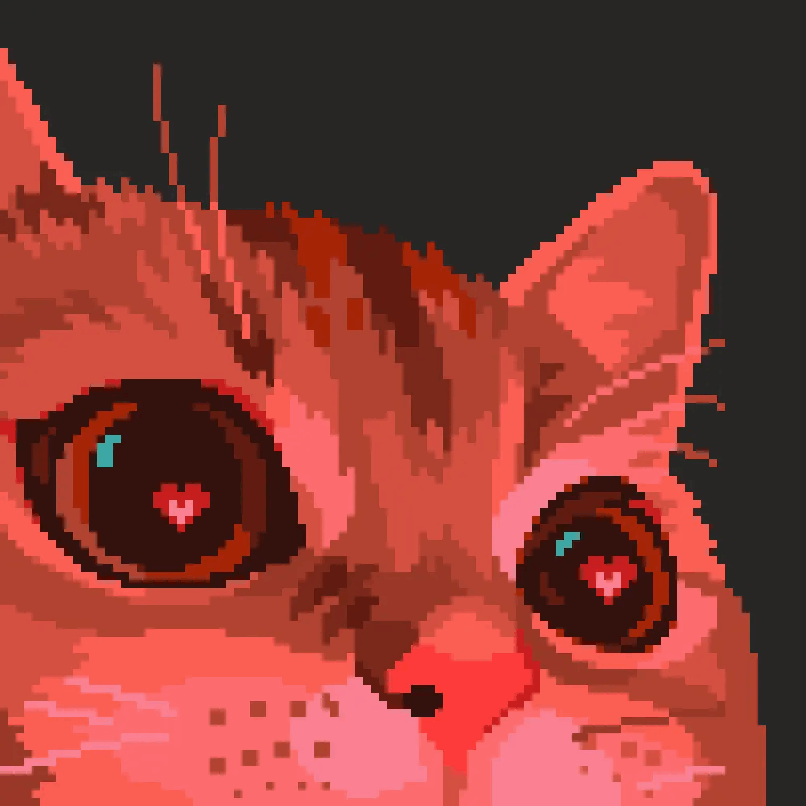

## ⚡ Sneekyboots | Backend and  Systems Engineer (Rust 🦀)

  
  

----

### 🥷 About Me

I'm a backend sorcerer with **Rust** 🦀 and **C++** ⚙️ as my primary spellbooks. I specialize in building high-performance **systems, games, and infrastructure**.

I'm a **blockchain beginner** currently channeling my backend energy into learning **Solana** and the high-speed mechanics of **Turbine**. My motto is: if it runs fast, breaks elegantly, or makes people laugh &rarr; I’ll build it.

Dramatic me Right now, I'm on a **Rust/Solana grind** ⚡: Transitioning from traditional systems to writing high-speed programs on a decentralized network.

-----

### ⚙️ Core Stack

| Category | Key Tech & Vibe |
| :--- | :--- |
| **Backend / Systems** | **Rust** (Memory safety but make it metal 🤘) &bull; **C++** (Pain, but character-building pain) &bull; Performance Tuning |
| **Blockchain (Learning)** | **Solana** (Native Rust Programs) &bull; Anchor &bull; ZK Proofs &bull; EVM/Solidity basics |
| **Games** | Unity &bull; Gamemaker &bull; AR/VR &bull; Random cursed prototypes |

-----

### 🚀 Great Projects & Wins (Proving I Can Build)

These projects showcase my technical depth in systems, AI, and complex logic:
### 🚀 Projects & Wins  
| Project                    | Description                             | Highlight                   |
|----------------------------|---------------------------------------|-----------------------------|
| 🧬 Cyto Sherlock           | AI pathology assistant                 | 🏆 AWS Hackathon Winner     |
| 🌱 Bhoomi                  | Crop & soil analytics                  | Google HackforChange         |
| 🛰️ ZK Proof-of-Location    | Privacy-preserving location proofs    | Early ZK experiments         |
| 🎮 Gamers DAO             | Experimental governance for gamers    | Open Source                 |
| 🐍 Rust Snake             | Masochist-grade systems-level Snake   | Source Available             |

-----

### 🤡 Side Quests (Solana & Silly Stuff)

The stuff I build to amuse myself (and confuse others):

  * **Solana Cursed To-Do List:** Pay gas fees to remember milk 🥛.
  * **MyBuds 📝:** Three sarcastic AI personalities who roast you, sass you, and *also* lowkey help with your problems.
  * **Potato Politics Simulator** 🥔🗣️.
  * **Goofy Ducks 🦆:** Still figuring out their world domination plan.

-----

### 💡 Fun Mode & Philosophy

| Aspect | The Vibe |
| :--- | :--- |
| **Battlefield** | Backend supremacy (fight me frontend folks 💅). |
| **Current Mission** | Applying systems-level Rust knowledge to Solana programs. |
| **Hidden Talent** | Can debug segfaults and still dance to EDM. |
| **Motto** | *"If it’s cursed but compiles &rarr; it lives."* |
| **Ego** | Loves being the **main character** — at least in my own README 😏. |

-----

### 🌍 Connect With Me

