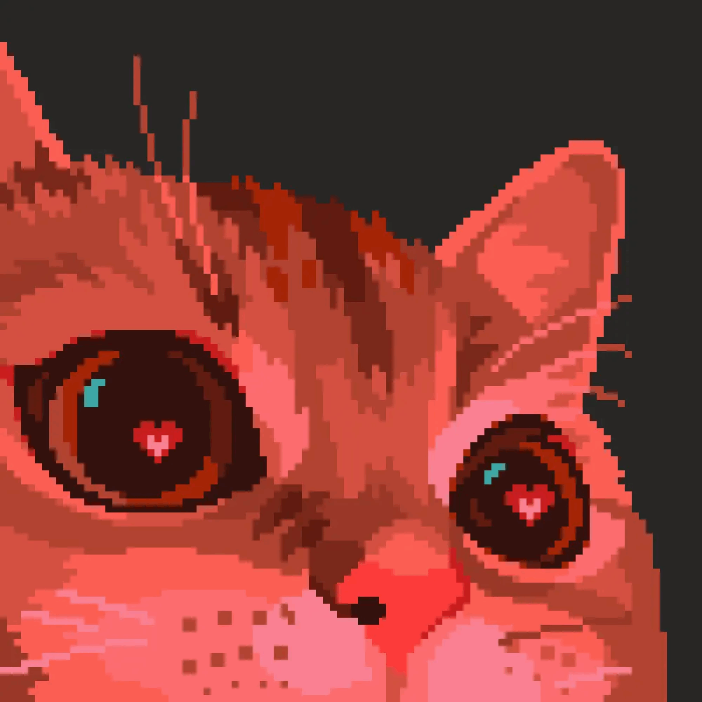

<div align="center">




**`sneekyboots` · backend & systems · sometimes just a goofhead`**

[](mailto:sneekyboots122@gmail.com)
[](https://github.com/Sneekyboots)

</div>

---

```
> WHO_AM_I.exe

Loading...  ████████████████  100%

Maybe a panda. Maybe an owl. Definitely compiling something cursed right now.
An animator and systems engineer who notices the tiny details people love
 then builds something unreasonably cool with them.
Currently applying systems-level Rust knowledge to Solana programs
at Hogwarts (aka Turbine). 
```

<div align="center">
</div>

---

## ⚙️ Stack

> *my secret stack ig*

| Layer | What I'm working with |
|---|---|
| 🦀 **Systems** | Rust · C++ · Performance tuning · Pain (affectionate) |
| ⛓️ **Blockchain** | Solana native programs · Anchor · ZK Proofs · EVM / Solidity |
| 🎮 **Games** | Unity · GameMaker · AR/VR · random cursed prototypes |

---

## 🏆 Projects & Wins

> *I wish I could include some personal stuff here but keeping it professional 🫡*

| Project | What it does | The win |
|---|---|---|
| 🔬 **Cyto Sherlock** | AI pathology assistant | 🥇 AWS Hackathon Winner |
| 🌱 **Bhoomi** | Crop & soil analytics | Google HackforChange |
| 🔐 **ZK Proof-of-Location** | Privacy-preserving location proofs | Early ZK experiments |
| 🎮 **Gamers DAO** | Experimental governance for gamers | Open Source |
| ✨ **Nexus** | *you know* | Personal W |

---

## 💡 The Vibe

```
Battlefield      →  Backend supremacy. Fight me, frontend folks.
Current mission  →  Solana programs in native Rust. The good pain.
Hidden talent    →  Can debug segfaults and still dance to EDM.
Ego check        →  Main character. At least in my own README.
Motto            →  "If it's cursed but compiles → it lives."
Species          →  Panda? Owl? Compilation unit? TBD.
```

<div align="center">

</div>

---

## 🌍 Connect

> I eat good — you better come with something interesting, hun.

<div align="center">

[](mailto:sneekyboots122@gmail.com)
[](https://github.com/Sneekyboots)

<br/>


*"If it compiles, it ships. If it ships, it lives. If it lives... good luck."*

</div>
